<div align="center">


# Causeway

**A road to cameras you cannot otherwise reach.**

Watch them live, record them, and know which hop failed when one does.

[](CHANGELOG.md)
[](backend/tests)
[](backend/pyproject.toml)
[](frontend/package.json)

</div>

<div align="center">
  
</div>

---

Cameras on a customer's private network are behind a VPN, then behind a jump
host, then on an address only that jump host can route to. Getting a picture out
of one is a chain of four or five hops, any of which can fail, and when it does
the usual answer is "it isn't working" with no indication of which hop.

Causeway is the road laid across that gap. The chain becomes a first-class
thing: eight named gates, walked in order, each reporting for itself. A hop a
profile does not use is shown as **skipped**, not hidden, so *not needed* never
looks like *never checked*.

```
  VPN dial → certificate trust → whitelist → route to jump host
     → SSH auth → port forward → camera reachable → stream handshake
```

## What it does

- **Connects** — Fortinet, GlobalProtect/Palo Alto, WireGuard, or nothing at all
  when the cameras are already reachable. One network namespace per profile, so
  three teams can hold three VPNs on one host and a dropped tunnel takes its own
  traffic down and nobody else's.
- **Watches** — live preview in the browser over WebRTC. Two people watching one
  camera cost one camera session, because cameras cap those hard.
- **Records** — RTSP and the inferred HLS feed at once, into sealed segments
  that survive a mid-write outage, uploaded to S3-compatible storage. A recording
  that lost thirty seconds says so, and says *why*, in a sidecar that travels
  with the file.
- **Compares** — the raw feed and the inferred feed side by side on one
  transport, aligned on wall-clock time so a gap in one does not silently shift
  the other.

## Three ideas worth knowing

**The kill switch is a routing fact, not a policy.** Inside a profile's
namespace the default route belongs to the tunnel. When the VPN drops there is
no route for camera traffic to fall back to, so it fails instead of quietly
leaving by the host's normal egress. Control-plane traffic reaches Postgres and
Redis over a more specific route that survives the default being replaced.

**Segments are MPEG-TS, not MP4.** An MP4 becomes readable when its `moov` atom
is written, which happens when the muxer exits cleanly — exactly what does not
happen when a tunnel dies mid-write. Whatever reached the disk as TS plays. The
session is concatenated to MP4 at the end, where there is a clean exit to rely
on.

**A failure names the hop that failed.** Not "connection error". The database
password, the missing kernel module, the camera that authenticated and then
refused the stream — each arrives as the sentence an operator can act on. Most
of the tests in this repo exist to keep it that way.

## See it work

The animation above is the real sequence, at real proportions: eight gates in
order, one of them skipped because this profile has no whitelist endpoint, and
the picture arriving after the last one passes. The whole thing takes about five
seconds against a camera behind a VPN and a jump host.

What it does not show, because a still cannot: when a hop fails, the ladder
stops at that hop and says why. `The gateway refused the connection - check the
username and password` on gate 1 is a different afternoon from `127.0.0.1:20000
forwards to 10.20.30.42:554` on gate 6, and the product's job is to tell you
which one you are having.

## Quick start

```bash
git clone https://github.com/Zafeeruddin/causeway && cd causeway
cp .env.example .env          # then edit: secrets, storage, PREVIEW_HOST
docker compose up -d --build
docker compose exec api cam init-db
docker compose exec api cam create-admin you@example.com
```

The dashboard is on `:3000`, the API on `:8000`. For a real deployment —
nginx, TLS, a domain, GPU passthrough, and the resource numbers behind the
sizing — see **[deploy/production.md](deploy/production.md)**.

## Roles

| | Superadmin | Admin | Viewer |
|---|---|---|---|
| Teams | all, can create | own only | own only |
| Connection profiles | all | own teams | **section not shown** |
| Cameras | all | add, remove, test | see, preview, record, download |
| Accounts | any role | viewers, own teams | — |

Viewers are not shown the plumbing and then stopped at the door — the sections
are absent. Most people using this want to watch a camera and take a clip away,
and a menu full of gateways and storage thresholds is a usability problem for
them, not a security one. The server enforces the same boundary either way.

## What it costs to run

Measured, not estimated — full numbers in
[deploy/production.md](deploy/production.md).

| | CPU | Memory |
|---|---|---|
| Idle, whole stack | ~5% of one core | ~275 MB |
| Preview, H.264 (stream copy) | 3% of one core | 46 MB |
| Preview, H.265 (transcoded) | 55% of one core, or a fraction on NVENC | 222 MB |
| Recording, any codec | 1% of one core | 43 MB |

A configured camera costs nothing. Cost arrives when somebody watches or
records. H.265 previews are the only expensive thing here, because no mainstream
browser decodes H.265 over WebRTC — those and only those are re-encoded, on an
NVIDIA card when there is one, and the machine refuses a stream past its budget
rather than admitting it and juddering across every stream at once.

## Layout

```
backend/app/
  net/          namespaces, ssh, vpn drivers, process runners
  gates/        the eight-rung ladder
  recorder/     ffmpeg argv, session supervisor, shipper, accelerators
  services/     connections, preview, playback, camera import
  storage/      object store, key layout, retention
  api/routes/   auth, profiles, cameras, recordings, admin
frontend/src/   Next.js dashboard
deploy/         Dockerfiles, production compose, runbooks
```

`make test` · `make lint` · `make up`

## Documentation

- **[deploy/production.md](deploy/production.md)** — deploying, sizing, nginx,
  and the things that fail silently if you skip them
- **[deploy/versity-setup.md](deploy/versity-setup.md)** — the storage gateway
- **[ROADMAP.md](ROADMAP.md)** — deferred work, each entry with what would
  trigger it and what would have to change
- **[CHANGELOG.md](CHANGELOG.md)** — what shipped when

## Status

**0.2.0 — running in production for its first customer.**

Still `0.x` on purpose: the schema has no migrations yet
([ROADMAP entry 10](ROADMAP.md)), so a release can still require a rebuild
rather than an upgrade. `1.0.0` is the version that promises otherwise.

## License

Not yet licensed for redistribution. An open-source license is planned; until
one is added here, all rights are reserved.
